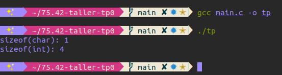
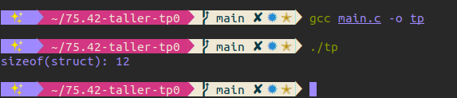
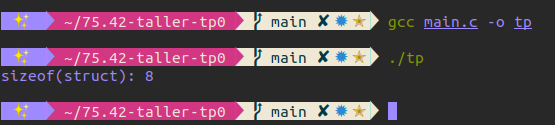

# [75.42] Taller de programación I
## Trabajo práctico 0: Contador de palabras<br><sup>2do cuatrimestre 2020</sup>

**Camila Serra**  
**97422**  
**camilaserra5@gmail.com**  
**https://github.com/camilaserra5/75.42-taller-tp0**

_________________
## Introducción

## Paso 0: Entorno de trabajo
Se realizó un programa en ISO C que imprime por consola “Hola Mundo” y retorna 0. Se muestra la ejecución del mismo con y sin valgrind.


#### ¿Para qué sirve Valgrind? ¿Cuáles son sus opciones más comunes?
Valgrind es una herramienta que sirve para monitorear el uso de memoria en la ejecución de programas. Además, tiene varias utilidades para hacer profiling sobre los mismos.

Algunas de las opciones que ofrece son:
* **memcheck**: sirve para encontrar leaks de memoria y otros errores asociados (por ej: tratar de leer fuera de lo reservado)
* **cachegrind**: analiza el rendimiento de la caché en la ejecución
* **callgrind**: es bastante similar a cachegrind, arma un árbol con las llamadas a funciones
* **massif**: analiza el consumo de memoria
* **helgrind**: busca errores de sincronización

#### ¿Qué representa sizeof()? ¿Cuál sería el valor de salida de sizeof(char) y sizeof(int)?
sizeof() devuelve el tamaño (en bytes) de la variable que toma por argumento. Esto depende de la arquitectura donde se corra el programa. Sirve para saber cuanta memoria alocar.
```c
#include <stdio.h>

int main() {
    printf("sizeof(char): %ld\n", sizeof(char));
    printf("sizeof(int): %ld\n", sizeof(int));
    return 0;
}
```



#### ¿El sizeof() de una struct de C es igual a la suma del sizeof() de cada uno sus elementos?
Esto puede ser cierto o no, depende el caso. Dependiendo el próximo dato, se agrega un padding para evitar errores. En el siguiente ejemplo se puede ver como sí se cumple:
```c
#include <stdio.h>

typedef struct {
  int i;
  int j;
  int k;
} test;

int main() {
    printf("sizeof(struct): %ld\n", sizeof(test));
    return 0;
}
```



En este ejemplo se puede ver como no es cierto. Lo que sucede es que se hace un padding para completar los 8 bytes. Si tuviese por ejemplo un int (4 bytes) y un double (8 bytes), la estructura ocuparía 16 bytes (los primeros 4 para el int, los siguientes 4 de padding, y luego 8 para el double).
```c
#include <stdio.h>

typedef struct {
  int i;
  char j;
} test;

int main() {
    printf("sizeof(struct): %ld\n", sizeof(test));
    return 0;
}
```



#### STDIN, STDOUT, STDERR.
Son streams para el input (stream 0), output (stream 1) y error (stream 2)  respectivamete. El input lee del teclado, y el output/error imprimen por pantalla.
Para obtener el input desde un archivo en lugar de leer el teclado se usará $<$, de igual manera para imprimir el output o el error en un archivo se usará $>$
```shell
./example < inputfile
./example > outputfile
./example < inputfile > outputfile
./example 0<inputfile 1>outputfile 2>errorfile
```
Además, se puede utilizar el stdout como stdin de otro comando de la siguiente manera. El example2 recibirá como input el output de la primer ejecución.
```shell
./example in | ./example2
```
