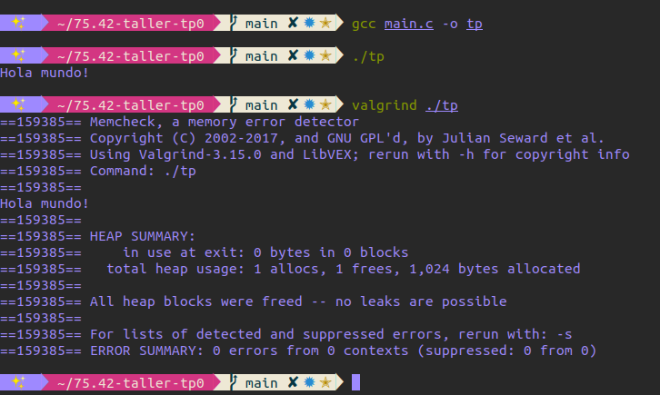

# [75.42] Taller de programación I
## Trabajo práctico 0: Contador de palabras<br><sup>2do cuatrimestre 2020</sup>

**Camila Serra**  
**97422**  
**camilaserra5@gmail.com**  
**https://github.com/camilaserra5/75.42-taller-tp0**

_________________
## Introducción

## Paso 0: Entorno de trabajo
Se realizó un programa en ISO C que imprime por consola “Hola Mundo” y retorna 0. Se muestra la ejecución del mismo con y sin valgrind.



#### ¿Para qué sirve Valgrind? ¿Cuáles son sus opciones más comunes?
Valgrind es una herramienta que sirve para monitorear el uso de memoria en la ejecución de programas. Además, tiene varias utilidades para hacer profiling sobre los mismos.

Algunas de las opciones que ofrece son:
* **memcheck**: sirve para encontrar leaks de memoria y otros errores asociados (por ej: tratar de leer fuera de lo reservado)
* **cachegrind**: analiza el rendimiento de la caché en la ejecución
* **callgrind**: es bastante similar a cachegrind, arma un árbol con las llamadas a funciones
* **massif**: analiza el consumo de memoria
* **helgrind**: busca errores de sincronización

#### ¿Qué representa sizeof()? ¿Cuál sería el valor de salida de sizeof(char) y sizeof(int)?
sizeof() devuelve el tamaño (en bytes) de la variable que toma por argumento. Esto depende de la arquitectura donde se corra el programa. Sirve para saber cuanta memoria alocar.
```c
#include <stdio.h>

int main() {
    printf("sizeof(char): %ld\n", sizeof(char));
    printf("sizeof(int): %ld\n", sizeof(int));
    return 0;
}
```


#### ¿El sizeof() de una struct de C es igual a la suma del sizeof() de cada uno sus elementos?
Esto puede ser cierto o no, depende el caso. Dependiendo el próximo dato, se agrega un padding para evitar errores. En el siguiente ejemplo se puede ver como sí se cumple:
```c
#include <stdio.h>

typedef struct {
  int i;
  int j;
  int k;
} test;

int main() {
    printf("sizeof(struct): %ld\n", sizeof(test));
    return 0;
}
```


En este ejemplo se puede ver como no es cierto. Lo que sucede es que se hace un padding para completar los 8 bytes. Si tuviese por ejemplo un int (4 bytes) y un double (8 bytes), la estructura ocuparía 16 bytes (los primeros 4 para el int, los siguientes 4 de padding, y luego 8 para el double).
```c
#include <stdio.h>

typedef struct {
  int i;
  char j;
} test;

int main() {
    printf("sizeof(struct): %ld\n", sizeof(test));
    return 0;
}
```


#### STDIN, STDOUT, STDERR.
Son streams para el input (stream 0), output (stream 1) y error (stream 2)  respectivamete. El input lee del teclado, y el output/error imprimen por pantalla.
Para obtener el input desde un archivo en lugar de leer el teclado se usará $<$, de igual manera para imprimir el output o el error en un archivo se usará $>$
```shell
./example < inputfile
./example > outputfile
./example < inputfile > outputfile
./example 0<inputfile 1>outputfile 2>errorfile
```
Además, se puede utilizar el stdout como stdin de otro comando de la siguiente manera. El example2 recibirá como input el output de la primer ejecución.
```shell
./example in | ./example2
```


## Paso 1: SERCOM - Errores de generacion y normas de programacion

#### Problemas de estilo detectados
> /task/student//source_unsafe/paso1_wordscounter.c:27:  Missing space before ( in while(  [whitespace/parens] [5]

```c
// faltaba un espacio entre el while y el paréntesis
} while (state != STATE_FINISHED);
```

> /task/student//source_unsafe/paso1_wordscounter.c:41:  Mismatching spaces inside () in if  [whitespace/parens] [5]

> /task/student//source_unsafe/paso1_wordscounter.c:41:  Should have zero or one spaces inside ( and ) in if  [whitespace/parens] [5]

```c
// dentro de la condición del if había un espacio de más entre el paréntesis y la condición
if ( c == EOF) {
```

> /task/student//source_unsafe/paso1_wordscounter.c:47:  An else should appear on the same line as the preceding }  [whitespace/newline] [4]

> /task/student//source_unsafe/paso1_wordscounter.c:47:  If an else has a brace on one side, it should have it on both  [readability/braces] [5]

```c
// el else tenía que estar en la misma línea que la llave de cerrar el if
} else if (state == STATE_IN_WORD) {
```

> /task/student//source_unsafe/paso1_wordscounter.c:48:  Missing space before ( in if(  [whitespace/parens] [5]

```c
// entre el if y el paréntesis tenía que haber un espacio
if (strchr(delim_words, c) != NULL) {
```
> /task/student//source_unsafe/paso1_wordscounter.c:53:  Extra space before last semicolon. If this should be an empty statement, use {} instead.  [whitespace/semicolon] [5]

```c
// entre la variable y el punto y coma no tenía que haber un espacio
return next_state;
```
> /task/student//source_unsafe/paso1_wordscounter.h:5:  Lines should be <= 80 characters long  [whitespace/line_length] [2]

```c
// la línea tenía más de 80 caracteres
// Tipo wordscounter_t: almacena la cantidad de palabras procesadas
// de un archivo.
```
> /task/student//source_unsafe/paso1_main.c:12:  Almost always, snprintf is better than strcpy  [runtime/printf] [4]

```c
// en lugar del strcopy se debería usar la función snprintf
strcpy(filepath, argv[1]);
```
> /task/student//source_unsafe/paso1_main.c:15:  An else should appear on the same line as the preceding }  [whitespace/newline] [4]

> /task/student//source_unsafe/paso1_main.c:15:  If an else has a brace on one side, it should have it on both  [readability/braces] [5]

```c
// el else tenía que estar en la misma línea que la llave de cerrar el if
} else {
```

#### Errores de generación del ejecutable
```
paso1_main.c: In function ‘main’:
paso1_main.c:22:9: error: unknown type name ‘wordscounter_t’
   22 |         wordscounter_t counter;
      |         ^~~~~~~~~~~~~~
paso1_main.c:23:9: error: implicit declaration of function ‘wordscounter_create’ [-Wimplicit-function-declaration]
   23 |         wordscounter_create(&counter);
      |         ^~~~~~~~~~~~~~~~~~~
paso1_main.c:24:9: error: implicit declaration of function ‘wordscounter_process’ [-Wimplicit-function-declaration]
   24 |         wordscounter_process(&counter, input);
      |         ^~~~~~~~~~~~~~~~~~~~
paso1_main.c:25:24: error: implicit declaration of function ‘wordscounter_get_words’ [-Wimplicit-function-declaration]
   25 |         size_t words = wordscounter_get_words(&counter);
      |                        ^~~~~~~~~~~~~~~~~~~~~~
paso1_main.c:27:9: error: implicit declaration of function ‘wordscounter_destroy’ [-Wimplicit-function-declaration]
   27 |         wordscounter_destroy(&counter);
      |         ^~~~~~~~~~~~~~~~~~~~
```

El error indica que el tipo **‘wordscounter_t’** no está declarado. Para solucionarlo habría que agregar el import del archivo **paso1_wordscounter.h** donde sí está declarado.
Las funciones a las que se está tratando de llamar tampoco han sido declaradas (se soluciona importando el mismo .h donde si están declaradas).

Ambos son errores del compilador.

#### ¿El sistema reportó algún WARNING? ¿Por qué?
El sistema no reportó ningun warning porque el flag -Werror convierte a errores los warnings. Si se compila sin ese flag se puede ver cual es un error y cual es un warning.


## Paso 2: SERCOM - Errores de generacion 2

#### Correcciones introducidas en este paso
En primer lugar, se cambió el uso de la función **strcpy** por **memcpy**. Además, hubo varios cambios en cuanto a las normas de codificación. Se alinearon correctamente las llaves y se eliminaron espacios innecesarios entre texto y paréntesis mencionados en el paso 1.

#### Verificación de normas de programación
Se puede ver como no hay errores en las normas de codificación.


#### Errores de generación del ejecutable
```
In file included from paso2_wordscounter.c:1:
paso2_wordscounter.h:7:5: error: unknown type name ‘size_t’
    7 |     size_t words;
      |     ^~~~~~
paso2_wordscounter.h:20:1: error: unknown type name ‘size_t’
   20 | size_t wordscounter_get_words(wordscounter_t *self);
      | ^~~~~~
paso2_wordscounter.h:1:1: note: ‘size_t’ is defined in header ‘<stddef.h>’; did you forget to ‘#include <stddef.h>’?
  +++ |+#include <stddef.h>
    1 | #ifndef __WORDSCOUNTER_H__
paso2_wordscounter.h:25:49: error: unknown type name ‘FILE’
   25 | void wordscounter_process(wordscounter_t *self, FILE *text_file);
      |                                                 ^~~~
paso2_wordscounter.h:1:1: note: ‘FILE’ is defined in header ‘<stdio.h>’; did you forget to ‘#include <stdio.h>’?
  +++ |+#include <stdio.h>
    1 | #ifndef __WORDSCOUNTER_H__
paso2_wordscounter.c:17:8: error: conflicting types for ‘wordscounter_get_words’
   17 | size_t wordscounter_get_words(wordscounter_t *self) {
      |        ^~~~~~~~~~~~~~~~~~~~~~
In file included from paso2_wordscounter.c:1:
paso2_wordscounter.h:20:8: note: previous declaration of ‘wordscounter_get_words’ was here
   20 | size_t wordscounter_get_words(wordscounter_t *self);
      |        ^~~~~~~~~~~~~~~~~~~~~~
paso2_wordscounter.c: In function ‘wordscounter_next_state’:
paso2_wordscounter.c:30:25: error: implicit declaration of function ‘malloc’ [-Wimplicit-function-declaration]
   30 |     char* delim_words = malloc(7 * sizeof(char));
      |                         ^~~~~~
paso2_wordscounter.c:30:25: error: incompatible implicit declaration of built-in function ‘malloc’ [-Werror]
paso2_wordscounter.c:5:1: note: include ‘<stdlib.h>’ or provide a declaration of ‘malloc’
    4 | #include <stdbool.h>
  +++ |+#include <stdlib.h>
    5 |
```
***

> **error: unknown type name ‘size_t’**

>  **error: unknown type name ‘FILE’**

El error indica que el tipo no está declarado. Los tipos 'size\_t' y 'FILE' no están declarados en ningún lado. Ambos habría que declararlos o importarlos de alguna librería. Son todos errores.

>  **error: conflicting types for ‘wordscounter_get_words’**

>  **note: previous declaration of ‘wordscounter_get_words’ was here**

Estos errores se deben a los anteriores. En la declaración de la función no tiene declarado el tipo de dato de retorno, entonces el compilador muestra este error.

>  **implicit declaration of function ‘malloc’**

Se utiliza la función malloc pero no se ha importado de ninguna librería ni implementado. Este es un warning (se muestra como error por el flag -Werror)

Son todos errores del compilador.

## Paso 3: SERCOM - Errores de generacion 3
#### Correcciones introducidas en este paso
En el archivo **wordscounter.h** se agregaron las siguientes librerias:

```c
#include <string.h>
#include <stdio.h>    
```

En el archivo **wordscounter.c** se agregó:

```c
#include <stdlib.h>    
```

#### Errores de generación del ejecutable
```
/usr/bin/ld: paso3_main.o: in function `main':
/task/student/source_unsafe/paso3_main.c:27: undefined reference to `wordscounter_destroy'
```
El error se debe a que la función **wordscounter_destroy** no está implementada (error de linker).
